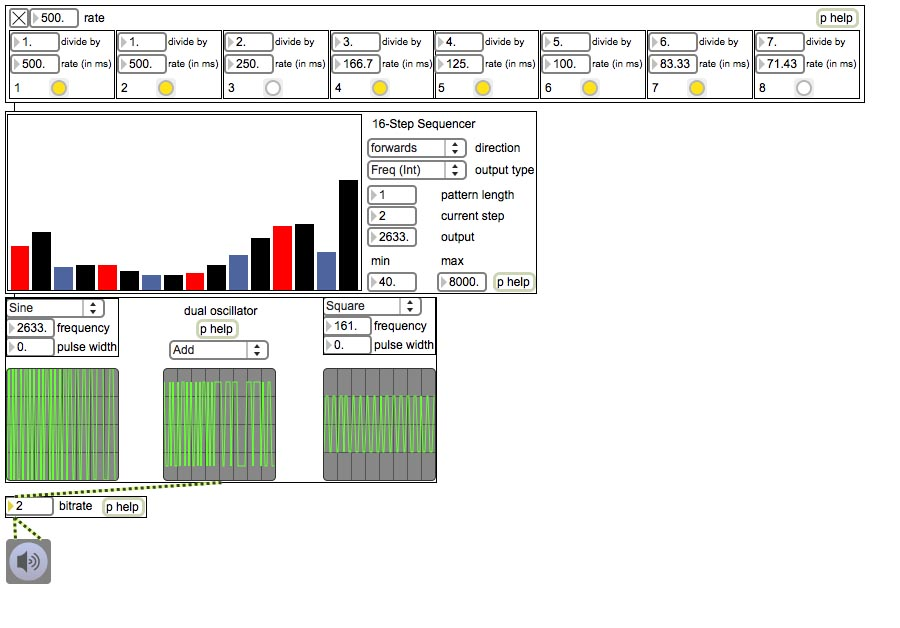



<a href="Euromax.zip">Download</a> now for Windows and Mac ( &lt; 1 MB), Updated December 3rd, 2010. See <a href="Release Notes.txt">Release Notes</a>.

<a href="Euromax2Alpha.zip">Download Euromax 2.0 ALPHA</a> now for Windows and Mac ( &lt; 1 MB), Updated December 9th, 2012.

New modules in Euromax 2.0 include: AD Envelope Matrix, Audio-to-Control, Bipolar Attenuators, Bipolar Mixers, Glisson Generator, Input Granulator, Logic Oscillator, Min/Max Audio + Control Processors, Per Grain Constant Q Filter, Quadrature Oscillator, Random Integer Generator, Sample + Hold, Simple ADSR, Simple Oscilloscope, Trainlet Generators, Two-Input Logic Gates, and a Wavefolder/clipper.

by Michael Hetrick, UCSB MAT

License: Please use these all you want for your own music projects. If you modify or port any of the modules (say, for Max 4 Live or PD) and wish to post them for download, please give credit to the source material and link to this site. You cannot sell any modified versions of these patches. If you do end up making an interesting port and want to be linked to (or hosted here), send me an e-mail.

&nbsp;

Recent Updates:

-December 9th, 2012: First alpha of Euromax 2.0. Many new modules, including a granular toolkit. Documentation forthcoming.

-December 3rd, 2010: Added MIDI modules. ASR missed values, now fixed (Thanks, Stuff Linear).

-December 2nd, 2010: Analog Shift Register now behaves as expected.

-November 24th, 2010: Beta 2 Uploaded. 3 new FM modules added (Simple FM Voice, Multi-Wave FM Voice, FM Voice Creator)

-November	24th, 2010: Beta 1 Uploaded. 31 Modules included.

&nbsp;

What it is:

EuroMax is a collection of Max/MSP bPatchers inspired by Eurorack modules. They vary from creative clock sources to wild-sounding oscillators. They are easily added to your patches through a right-click menu.

-All EuroMax patches are created with basic Max/MSP objects. This ensures cross-platform compatibility, and no extra externals need to be downloaded.

-The patches can be easily explored for learning or for modification. All patches come with detailed help files.

-These patches will be frequently updated, as these were made for my own use as well. Updates will not break old patches, as every module added to your own patches is completely saved with the patch.

&nbsp;

Known Bugs:

-Currently, Max doesn't send loadbang messages to objects instantiated from &quot;Paste From...&quot;. When instantiating objects with dropdown boxes (such as the oscillators), you will have to click the dropdown box to get the module working correctly. This also prevents objects like the Output Rotator and Metro Divider from instantiating with useful values. I've emailed Cycling74 about this.

&nbsp;

Coming Soon:

-Complex Oscillator

-Better panning algorithm on mixers

-Drum Synthesizer

-Cartesian Sequencer
