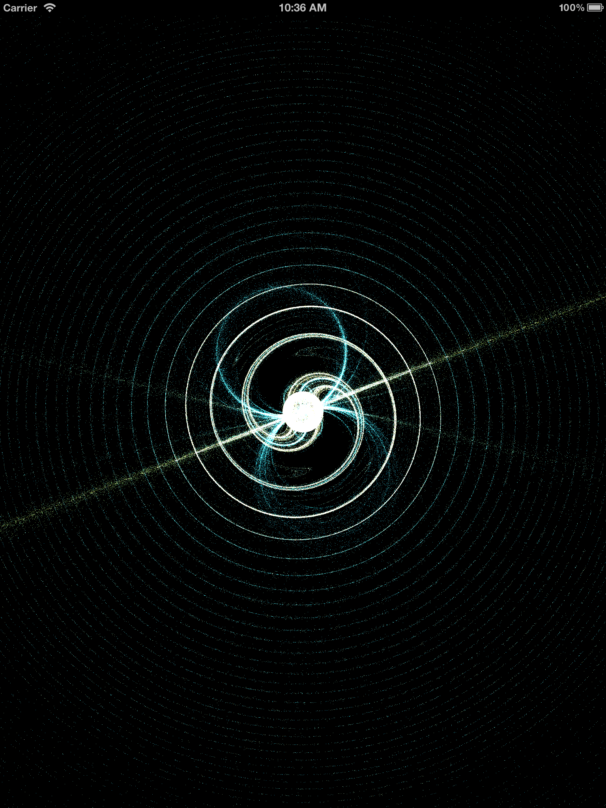
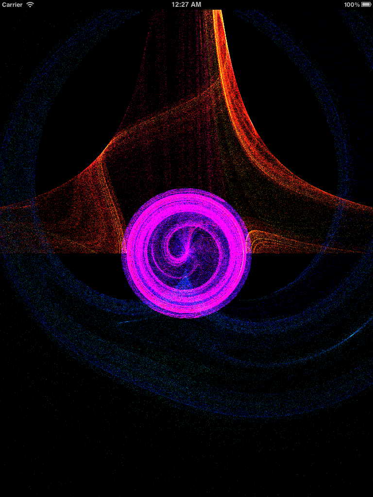
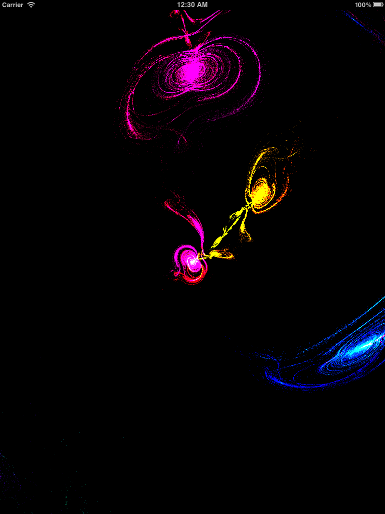
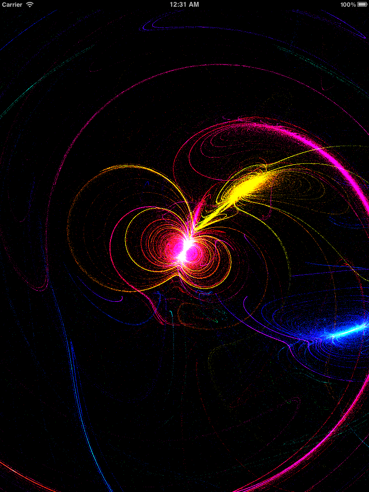



Fractal Blender is the next work of Iterative Art by the creator of DrawJong. Fractal Blender uses a heavily modified version of Scott Draves's Fractal Flame algorithm (as seen in Electric Sheep and Apophysis) to generate an infinite amount of the coolest, most colorful visuals you've seen on your iOS device.

Simple, gesture-based controls allow you to glide your fingers across the screen and watch as these equations morph in real-time. When you find an image that you love, you can render it and save it to your Photo Stream to use as wallpapers.

Fractal Blender is Retina Ready and optimized to work on all iOS 5 devices, including the new iPad!

<a href="http://itunes.apple.com/us/app/fractal-blender/id539265036?mt=8"> iTunes link </a>
 
 

 

