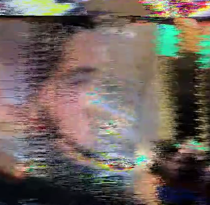



Description: 

&quot;Jitter&quot; is a term used to describe discontinuity in video or audio data. 
   
  Jitter is a library of video processing tools in Cycling 74's Max. 
   
  &quot;The Jitters&quot; is also a song by The Dismemberment Plan about being alone. 
   
This is a video about all of those things, as I've always felt that social anxiety is like a glitch in the human computer (We freeze, lock-up, stutter...). All video was filmed using a webcam, and processed using all-original code in Jitter. All music was made using samples recorded directly in front of the computer--no synthesis.

&nbsp;

Click the image to watch.
