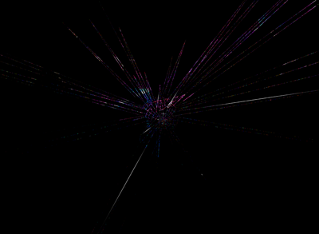
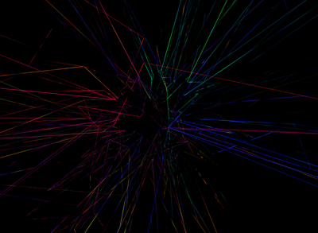
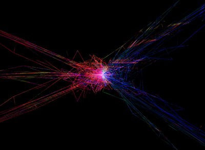
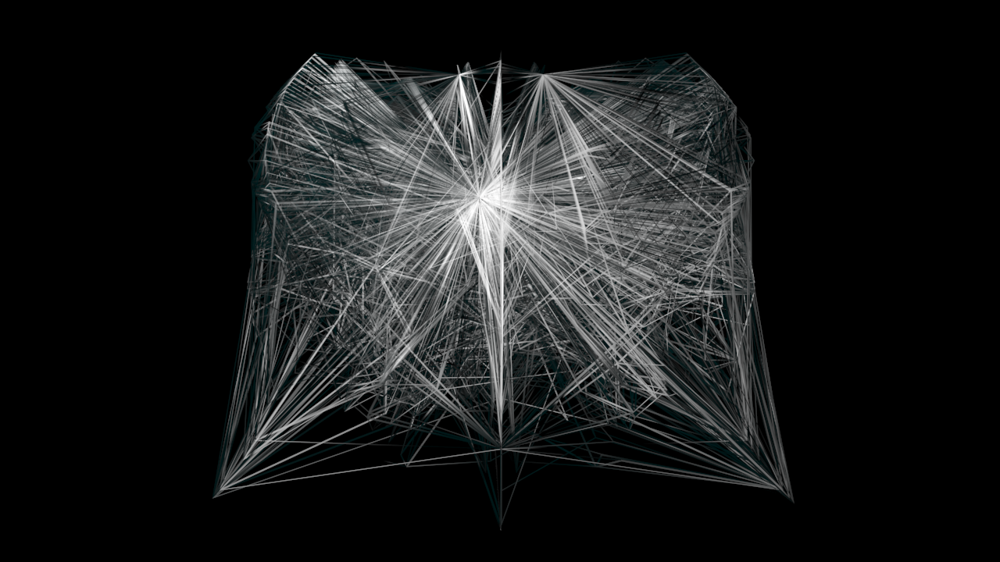
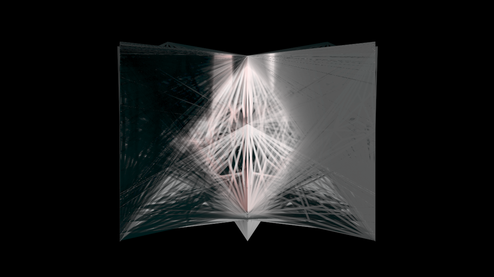
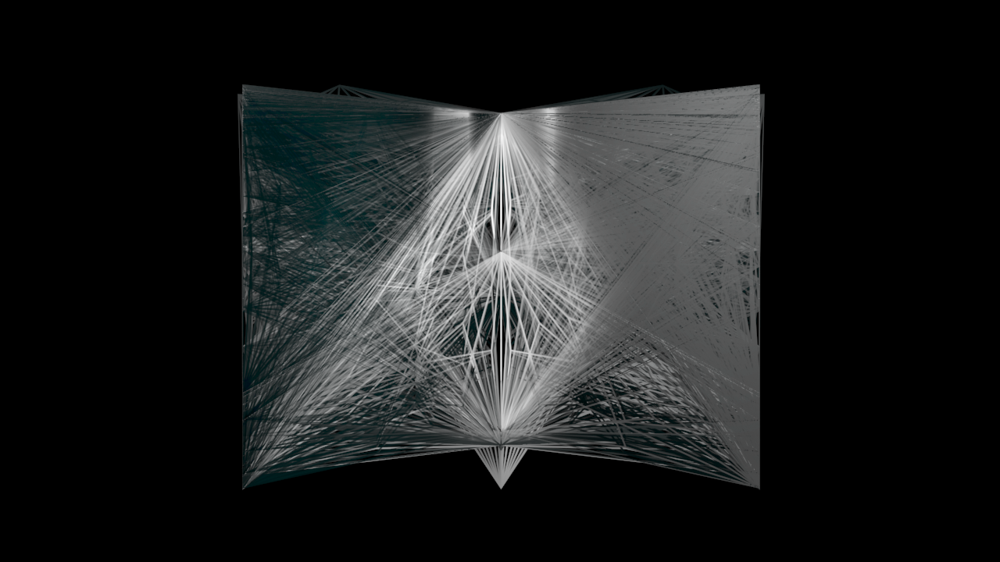
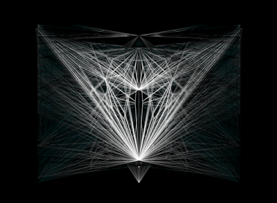



##Exploded Sphere

This first set of images was created by displacing a sphere mesh with a map created by my fractal program.

The first image uses a low resolution map, creating an interesting pixelated-yet-smooth illusion.

##Mantis

This image was created by generating a mesh in DrawJong, forcing a symmetry upon it in 3ds Max, and coloring it with a map generated by my fractal program.

##Diamond

This final set of images was created using the techniques used for Mantis. 

The final image uses spotlights, and is my personal favorite image created for the class. The final render is over 4000 pixels wide, and took 30 minutes to render. 

The version posted here is lower resolution, as I will be making prints of it.

