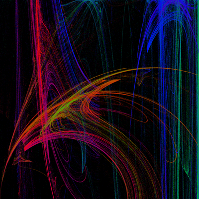
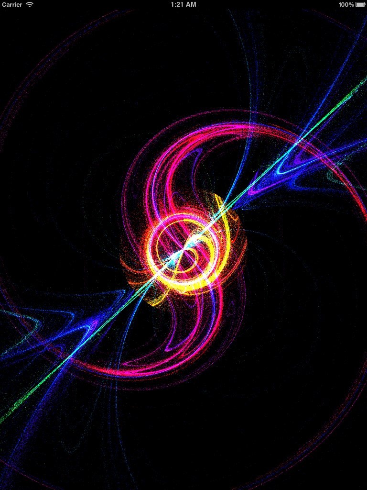
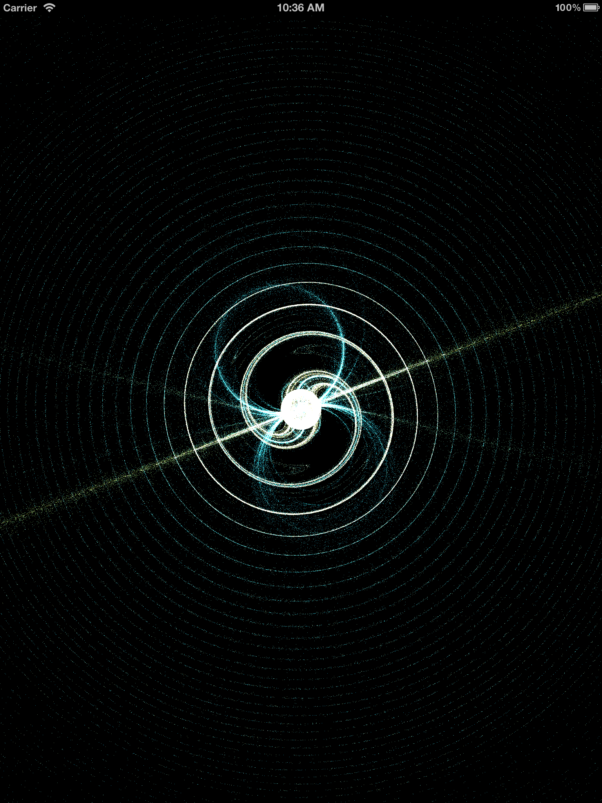



This is my current primary project outside of class. Out of this project, I created my final for Ted Kim's 200c class. 

The work here is also used in my final 3ds Max project for this class.

##Field Viewer
Here is an image from the Field Viewer (Ted Kim) version of my program:

##iOS App
Here are two images from the main iOS version of the program, which will be released this summer:

