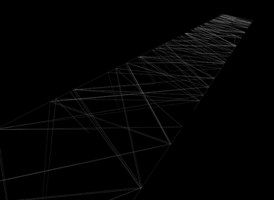
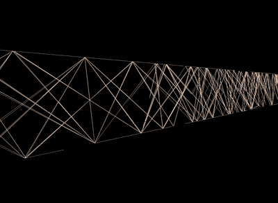
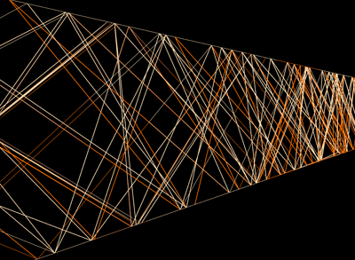



These figures were generated in Fugu by manipulating vertices with equations used in my program DrawJong.
These were rendered in 3ds Max.

In these images you can also see my process of learning how to edit materials in 3ds Max.