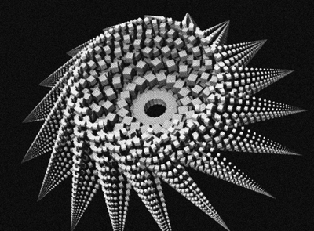
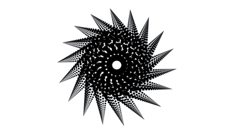
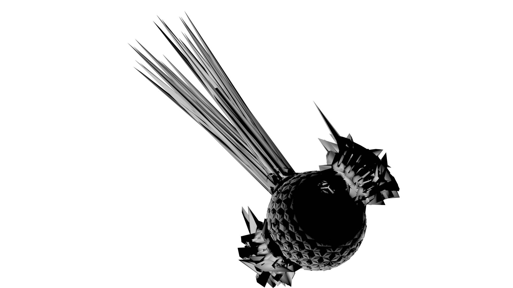



##Structure Synth
These first two images contain a figure generated by Structure Synth.

The first image contains a Photoshop manipulation of Structure Synth's output, while the second was rendered in 3ds max.

##TopMod
This next image was an OBJ created in TopMod and rendered in 3ds max.

