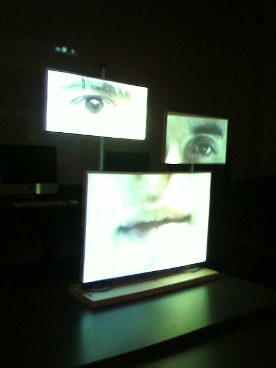
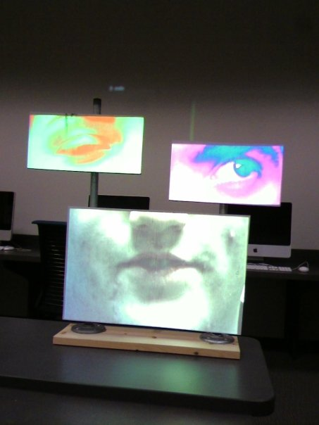
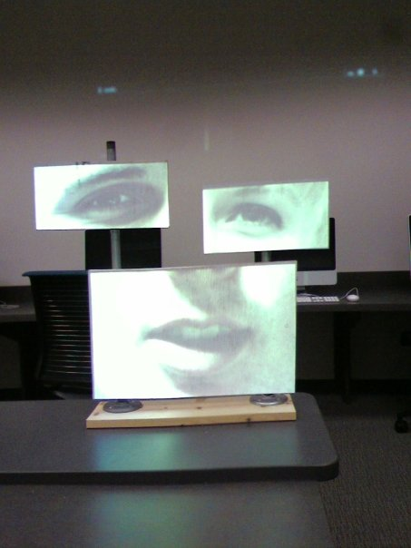
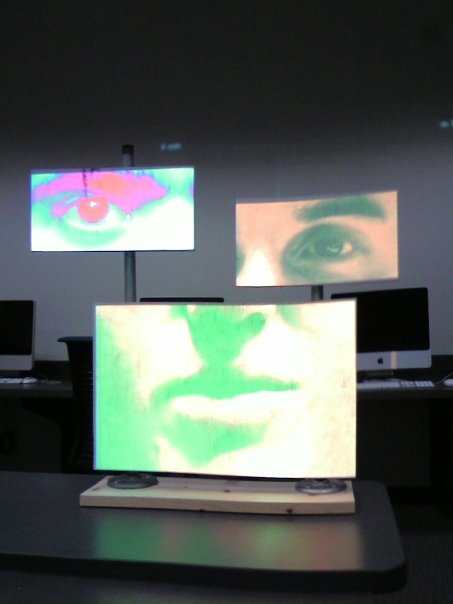



OLIVE JUICE

<em>Olive Juice</em> is an exploration of language, both verbal and physical. I filmed a few of my friends saying &ldquo;Olive juice,&rdquo; which looks identical to &ldquo;I love you,&rdquo; when lips are being read. I then filmed various facial expressions, both positive and negative. As the videos play, we see which expressions become dominant on a field of many, and which become the most sincere.

 

 

