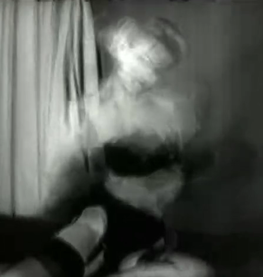



Description:

Originally planned as a series of generative videos, this instead turned into a meditation on ways that we use abstraction to communicate, and the ways in which we destroy everything that we create. 
   
Footage taken from the Prelinger Archives at archive.org.

&nbsp;

Click the image to watch.
